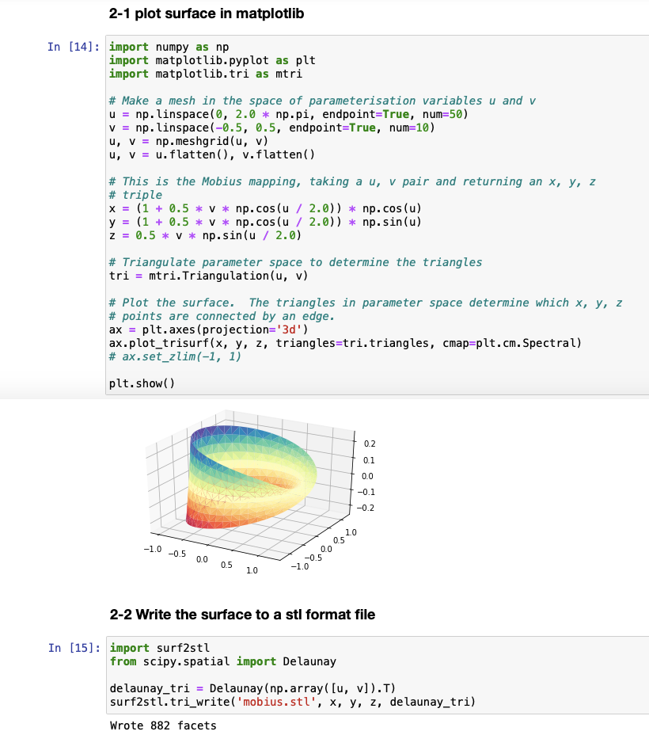

# Surf2stl.py

Export a surface to a STL(Stereolithography) file.

## Description
Functions in this script (write, tri_write) can export 3d surface to a STL (Stereolithography) format file. This is the python version of [surf2stl.m](https://jp.mathworks.com/matlabcentral/fileexchange/4512-surf2stl) in MATLAB (or Octave).

Exported files can be imported in various 3d software tools (like Blender, Meshlab, etc.)

## Installation
clone this repository

```Bash
git clone https://github.com/asahidari/surf2stl-python
```

## Usage
Write python script like this:

```python
import numpy as np
import surf2stl
 
x = np.linspace(-6, 6, 30)
y = np.linspace(-6, 6, 30)
X, Y = np.meshgrid(x, y)
Z = np.sin(np.sqrt(X ** 2 + Y ** 2))

surf2stl.write('3d-sinusoidal.stl', X, Y, Z)
```

Or like this:

```python
import numpy as np
from scipy.spatial import Delaunay
import surf2stl

u = np.linspace(0, 2.0 * np.pi, endpoint=True, num=50)
v = np.linspace(-0.5, 0.5, endpoint=True, num=10)
u, v = np.meshgrid(u, v)
u, v = u.flatten(), v.flatten()

x = (1 + 0.5 * v * np.cos(u / 2.0)) * np.cos(u)
y = (1 + 0.5 * v * np.cos(u / 2.0)) * np.sin(u)
z = 0.5 * v * np.sin(u / 2.0)

delaunay_tri = Delaunay(np.array([u, v]).T)
surf2stl.tri_write('mobius.stl', x, y, z, delaunay_tri)
```

If you use jupyter notebook,
'Surf2stl-python_example.ipynb' shows the examples with 3d graphs in matplotlib.





## Requirement
- Python 3
- numpy
- scipy
- matplotlib (to draw graph in python)

## Author
asahidari

## License
MIT
